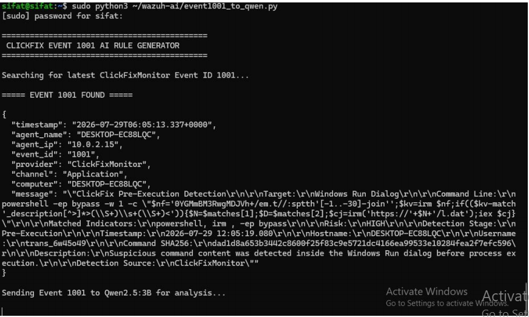
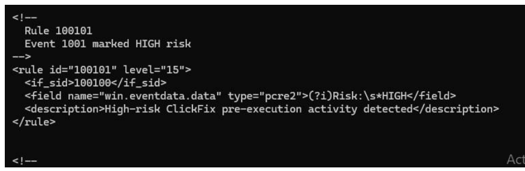
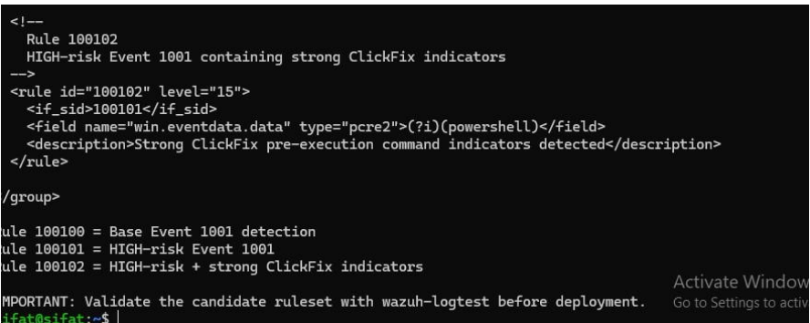
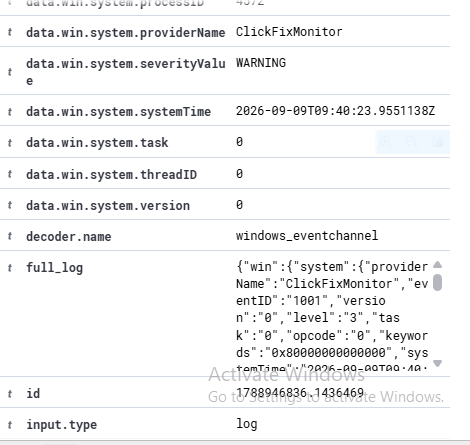
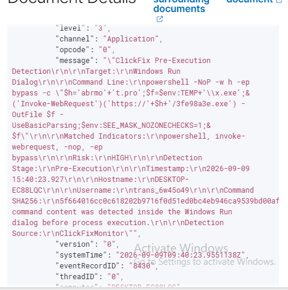

# Step-by-Step Reproduction Guide

## Project: ClickFix Detection and LLM-Assisted Rule Engineering

This guide follows the complete workflow:

**Step → Command → Screenshot → Result**

---

# 4. Local LLM Analysis (Qwen2.5:3B via Ollama)

After collecting ClickFixMonitor Event ID 1001, the event is forwarded to the local LLM for analysis.

## Command:

```bash
sudo python3 ~/wazuh-ai/event1001_to_qwen.py
```

The LLM provides:

- Verdict
- Risk level
- Suspicious indicators
- Detection logic suggestion
- Candidate Wazuh rules

## Event Sent to Qwen



## Qwen Analysis Output


## AI-Assisted Wazuh Rule Suggestion

The local LLM generated candidate Wazuh detection rules which were reviewed before deployment.

### Rule 100100 - Base Event Detection


### Rule 100101 - High Risk ClickFix Activity



### Rule 100102 - Strong ClickFix Indicator Detection



**Result:** AI-assisted Wazuh rule suggestions were generated from the ClickFixMonitor Event ID 1001 telemetry.

---

# 6. Final Detection Result

After human validation, the generated custom Wazuh rules were deployed and tested.

## Check Alerts

```bash
sudo tail -f /var/ossec/logs/alerts/alerts.json
```

## Detection Evidence

### Wazuh Detection Event


### Detected Event Details


### Event Detection Output





**Result:** The final custom Wazuh rule successfully generated the ClickFix detection alert.

---

# Complete Project Workflow

```text
ClickFix Attack Initiation
        ↓
User Copy/Paste Interaction
        ↓
ClickFixMonitor
        ↓
Windows Application Event ID 1001
        ↓
Wazuh Agent
        ↓
Wazuh Manager Event Collection
        ↓
Local LLM (Qwen2.5:3B via Ollama)
        ↓
Detection Logic / Wazuh Rule Suggestion
        ↓
Human Validation
        ↓
Final Custom Wazuh Rule
        ↓
Alert Generation
```
