# Step-by-Step Reproduction Guide

## Project: Detection Engineering for Emerging Phishing Campaigns Using Open-Source SIEM and Local LLM

This guide demonstrates the complete ClickFix phishing detection workflow.

**Step → Command → Screenshot → Result**

---

# 1. Lab Environment Setup

The cyber range was deployed using Oracle VirtualBox with three isolated virtual machines:

- Windows 11 Victim Machine
- Ubuntu Wazuh SIEM Server
- Ubuntu Local LLM Server

## VirtualBox Environment

The virtual machines were prepared before starting the ClickFix detection scenario.

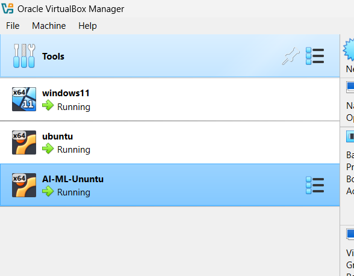

**Result:** Lab infrastructure successfully prepared.

---

# 2. Wazuh SIEM Deployment

## Install Wazuh Manager

```bash
sudo apt update && sudo apt upgrade -y

curl -sO https://packages.wazuh.com/4.15/wazuh-install.sh

sudo bash ./wazuh-install.sh -a
```

Verify service:

```bash
sudo systemctl status wazuh-manager
```

**Result:** Wazuh SIEM deployed successfully.

---

# 3. ClickFixMonitor Event Generation

The ClickFix simulation starts with a fake verification page that leads to user interaction and generates Windows Application Event ID 1001 through ClickFixMonitor.

Workflow:

```text
ClickFix Attack Initiation
        ↓
User Copy/Paste Interaction
        ↓
ClickFixMonitor
        ↓
Windows Application Event ID 1001
```

## ClickFix Evidence

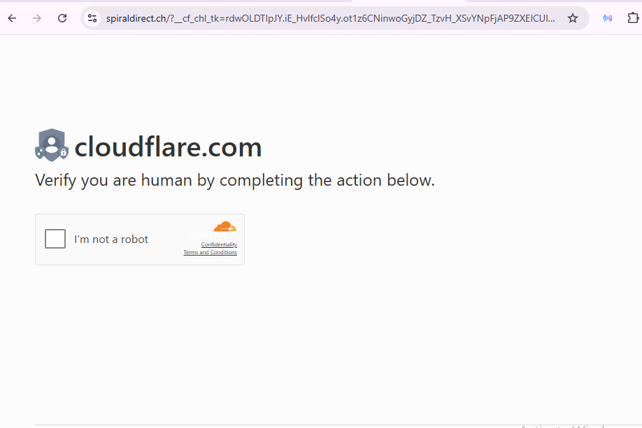
win+r

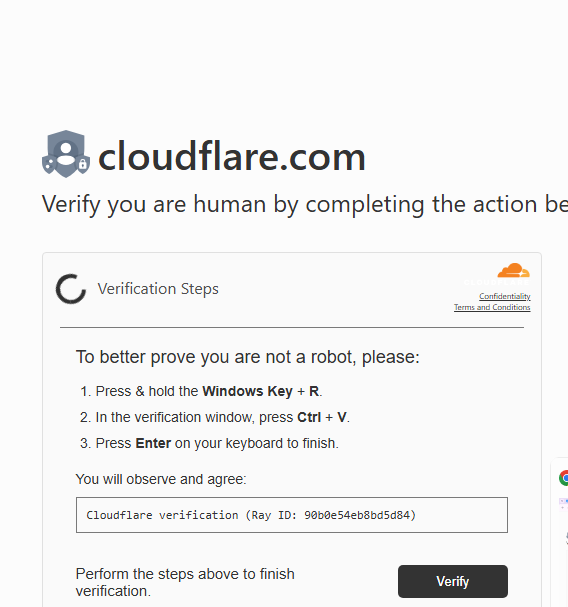

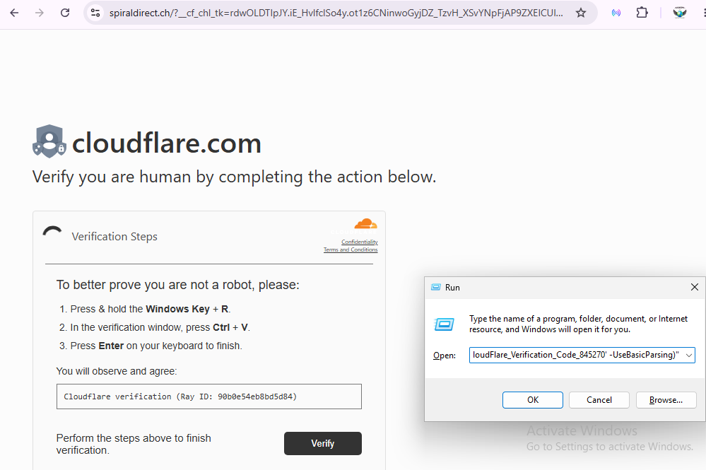

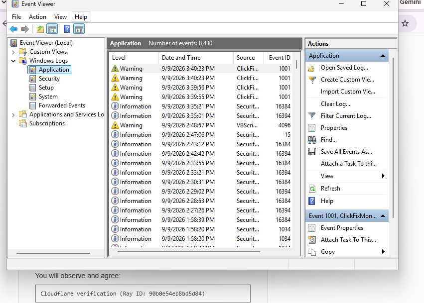

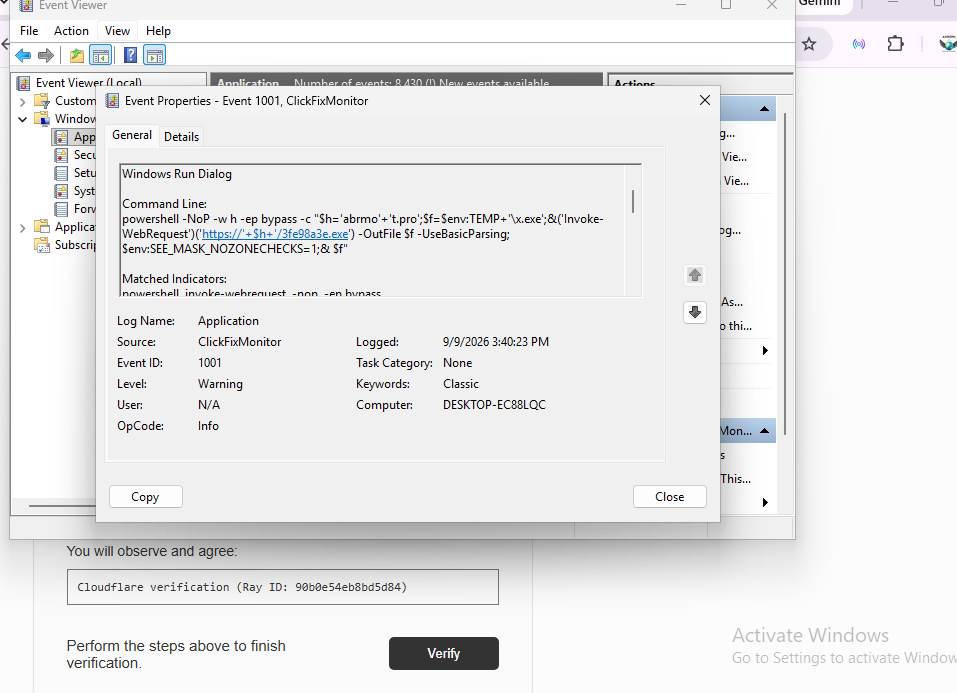

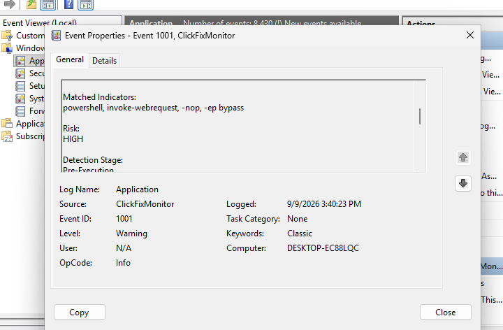

**Result:** ClickFixMonitor successfully generated Windows Application Event ID 1001 telemetry.

---

# 4. Local LLM Analysis (Qwen2.5:3B via Ollama)

The collected ClickFixMonitor Event ID 1001 is forwarded to the local LLM for analysis.

Command:

```bash
sudo python3 ~/wazuh-ai/event1001_to_qwen.py
```

The LLM provides:

- Verdict
- Risk level
- Suspicious indicators
- Detection logic suggestion
- Candidate Wazuh rules

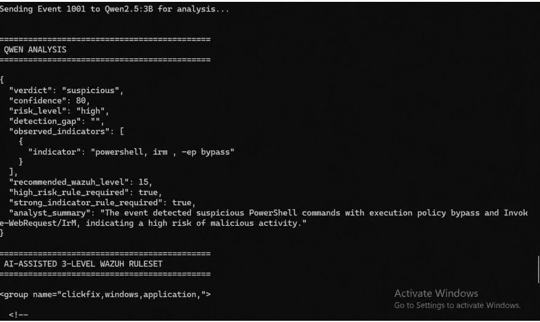

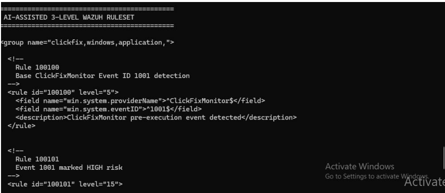

**Result:** AI-assisted Wazuh rule suggestions were generated.

---

# 5. Human Validation and Custom Rule Deployment

The generated rules were reviewed before deployment.

Validate rules:

```bash
sudo /var/ossec/bin/wazuh-logtest
```

Restart manager:

```bash
sudo systemctl restart wazuh-manager
```

**Result:** Validated custom Wazuh rules deployed successfully.

---

# 6. Final Detection Result

Check alerts:

```bash
sudo tail -f /var/ossec/logs/alerts/alerts.json
```
or see in DashBoard
Detection Evidence:

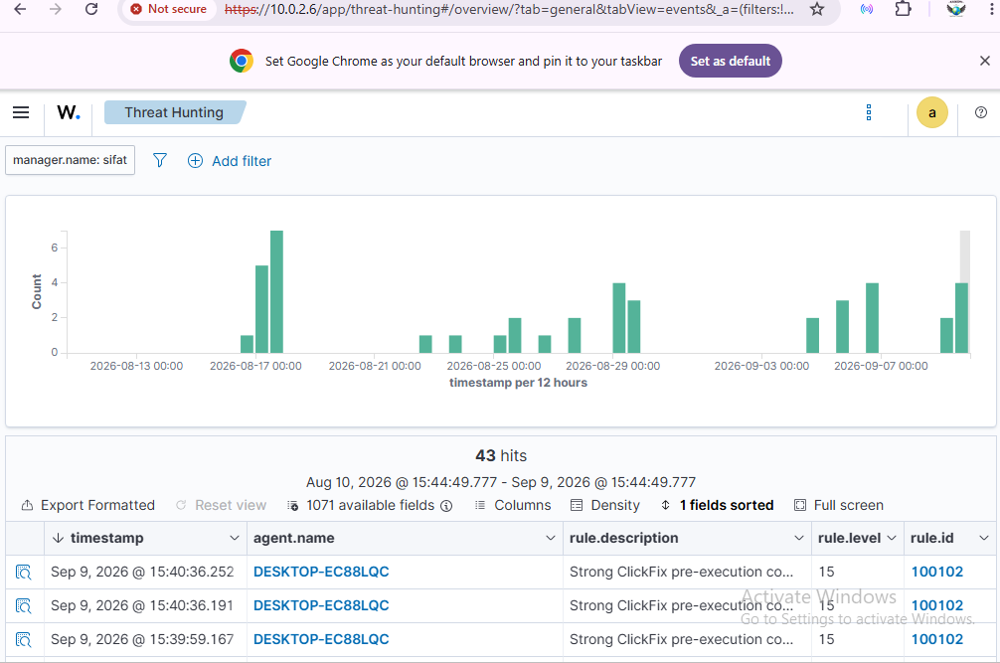

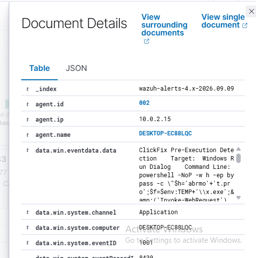

**Result:** Final custom Wazuh rule generated the ClickFix detection alert.

---

# Complete Project Workflow

```text
ClickFix Attack Initiation
        ↓
User Copy/Paste Interaction
        ↓
ClickFixMonitor
        ↓
Windows Application Event ID 1001
        ↓
Wazuh Agent
        ↓
Wazuh Manager Event Collection
        ↓
Local LLM (Qwen2.5:3B via Ollama)
        ↓
Detection Logic / Wazuh Rule Suggestion
        ↓
Human Validation
        ↓
Final Custom Wazuh Rule
        ↓
Alert Generation
```
